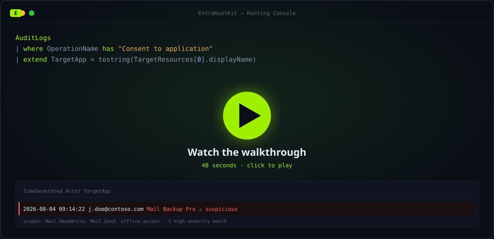

<h1 align="center">EntraHuntKit</h1>

  <strong>SecLists, but for M365 defenders.</strong> 
  Curated, ATT&CK-mapped, paste-ready threat-hunting queries + IOC lists for <strong>Entra ID, Intune & Microsoft 365</strong>. 
  Zero install — paste straight into <strong>Microsoft Defender XDR Advanced Hunting</strong> or <strong>Microsoft Sentinel</strong>.

  
  
  
  
  

  <em>Entra ID · Intune · Exchange Online · SharePoint · the whole M365 stack — the name says Entra, the coverage doesn't stop there.</em>

---

## Why 

Every M365 defender ends up with the same scattered folder of half-remembered KQL — one query from a blog, one from a conference slide, one they wrote at 2am during an incident. **EntraHuntKit is that folder, curated and ATT&CK-mapped**, so the queries you reach for during a consent-phishing or BEC investigation are one paste away.

- 🎯 **Plugs into tools you already run** — Defender XDR Advanced Hunting & Sentinel. No agent, no install, no new license to hunt with what you have.
- 🗂️ **Organised by [MITRE ATT&CK](https://attack.mitre.org/) tactic** — walk the kill chain from initial access to exfiltration.
- ✅ **Accurate & paste-ready** — real tables, real columns, real Entra audit operations. No invented schema.
- 🔁 **Continuously updated** — new detections land as the threats do. ⭐ **Star it to bookmark it and get the updates.**

---

---

## ⭐ Star this repo

If a query here saves you even one hour during an incident, **star the repo** — it's the cheapest way to bookmark it, and starring means GitHub shows you when new detections drop. That's the whole deal: keep it in your back pocket, watch for updates.

---

## How to use it

### In Microsoft Defender XDR (Advanced Hunting)
1. Go to **security.microsoft.com → Hunting → Advanced hunting**.
2. Grab a query tagged **Defender XDR** (tables like `CloudAppEvents`, `AADSignInEventsBeta`).
3. Paste, adjust the time range, **Run**. Tune with the false-positive note before you alert on it.

### In Microsoft Sentinel
1. Open your **Log Analytics / Sentinel** workspace → **Logs**.
2. Grab a query tagged **Sentinel** (tables like `SigninLogs`, `AuditLogs`, `OfficeActivity`, `IntuneAuditLogs`).
3. Paste, run, and — once tuned — click **New alert rule → Create Sentinel alert** to operationalise it.

> Each query names the **table**, the **platform**, and the **license tier** it needs, plus an "Also in" pointer to the other surface. Read the tuning note before alerting — thresholds here are starting points, not gospel.

---

## ATT&CK coverage

| Tactic | Queries | Techniques covered |
|---|---|---|
| [Initial Access](hunting/initial-access/) | 3 | `T1078` · `T1078.004` |
| [Persistence](hunting/persistence/) | 5 | `T1528` · `T1098` · `T1098.001` · `T1098.003` · `T1137.005` · `T1484.002` |
| [Defense Evasion](hunting/defense-evasion/) | 3 | `T1562.001` · `T1562.007` · `T1562.008` |
| [Credential Access](hunting/credential-access/) | 2 | `T1110.003` · `T1621` |
| [Discovery](hunting/discovery/) | 1 | `T1087.004` |
| [Collection](hunting/collection/) | 1 | `T1114.003` · `T1564.008` |
| [Exfiltration](hunting/exfiltration/) | 1 | `T1567` · `T1530` |

**IOC reference lists** → [`ioc/`](ioc/): [malicious/abused OAuth app IDs](ioc/malicious-oauth-app-ids.md) · [suspicious inbox-rule patterns](ioc/suspicious-inbox-rule-patterns.md) · [high-risk Graph permission scopes](ioc/risky-graph-permission-scopes.md)

---

## Proof it works

---

## DEMO

**▶ [Open the live demo console →](https://juandresrodca.github.io/EntraHuntKit/demo/)** — explore all 16 detections in your browser. Zero install, no tenant needed.

Or watch the 48-second walkthrough:

  

▶ Click the poster to play, or explore the <a href="https://juandresrodca.github.io/EntraHuntKit/demo/">live interactive demo</a> where it plays inline.

---

## What's in scope

Defensive / blue-team hunting for the M365 attack surface:

- **Entra ID** — risky sign-ins, legacy auth, password spray, MFA fatigue, illicit OAuth consent, app-credential backdoors, privileged role grants, federation tampering.
- **Intune / MDM** — compliance & configuration policy tampering that undermines device-based Conditional Access.
- **Exchange Online / M365** — BEC inbox rules (forward, redirect, hide, delete), mailbox audit disable, mass mail/file exfiltration.

---

## Authorized use only

These queries are for **defending tenants you are authorized to defend** — your own environment or one you have explicit permission to protect. They are detection/hunting logic, not exploitation tooling. Test in a non-production workspace first and tune thresholds to your own baseline before wiring anything to an alert or automated response.

---

## Contributing

New detections, better tuning, and confirmed IOCs (with sources) are all welcome — see [CONTRIBUTING.md](CONTRIBUTING.md). The one hard rule: **every query must be accurate and paste-ready** — real tables, real columns, no invented schema.

---

## License

[MIT](LICENSE) © Juan Andres Rodriguez — use it, fork it, ship it.
